# BRSM Movie Memory Experiment Report

## 1. Introduction
Our memories of everyday occurrences typically don't feel like a single, continuous stream. Rather, our brains organically split experiences into simpler, manageable chunks known as "events."
 
Even though the mechanisms underlying this segmentation are well-defined, an important issue still needs to be addressed: how strong is our memory when this normal segmentation process is purposefully disrupted?

This experiment investigates the implications of purposefully altering these natural boundaries. In particular, we study how memory encoding and recognition are affected by changing the timing of event boundaries. Short video clips that either ended at natural event boundaries or were abruptly cut just before a boundary occurred were shown to the participants. The study compares these two conditions to see if disrupting the brain's natural event-updating process has an impact on participants' recognition accuracy, response times, and confidence in their memories, as well as memory consistency, or how well they can distinguish previously seen frames from similar but unseen ones.

---

## 2. Background Overview
The base of the study of human perception of continuous activity is **Event Segmentation Theory (EST)**.According to this theory, incoming information is not processed by the human brain as a continuous, uninterrupted feed. Rather, it organically splits ongoing experiences into discrete, controllable units known as "events." 

The brain's constant need to predict the near future is what drives EST. Our perceptual predictions fail when sensory cues - like a person's location, the lighting in a room, or the camera angle in a film - change suddenly. This failure generates a "prediction error" that prompts the brain to mark an **event boundary**. At this boundary, the brain effectively closes out its current working memory model of the situation and stores that previous segment into long-term memory. 

Manipulating these boundaries allows researchers to observe how memory is structured.  Moving through a doorway, for instance, causes an event update that affects short-term memory of the previous room. On the other hand, the precise times when an event boundary occurs serve as powerful "anchors," which enable the recall of objects or actions that were present at that precise moment in long-term memory. Sudden camera cuts serve as artificial event boundaries in the context of film editing, providing us with a controlled method to examine the effects of upsetting a viewer's expected event model on memory accuracy and confidence.

---

## 3. Dataset Overview
To answer these questions, we make use of the data collected which records participant behavior during the two primary stages of the experiment: the encoding phase, during which participants watched the videos, and the recognition phase, during which their ability to recall the videos was evaluated. To gain a deeper understanding of the participant pool, we also gathered basic demographic data in addition to behavioral responses from these phases.

### 3.1 The Two Viewing Conditions
The core of our study relies on splitting participants into two distinct groups based on the types of videos they watched:
*   **The Natural Cut Group (`_NB`):** These participants watched 40 videos that played out normally, ending at a natural, expected event boundary.
*   **The Abrupt Cut Group (`_AB`):** These participants watched the same videos, but the clips were abruptly cut off 1 to 5 seconds before the natural boundary occurred. 

**Note:** The lengths of the natural videos were slightly adjusted so that both groups spent the same average amount of time watching.

Because watching 40 videos can easily lead to zoning out, The inclusion of a "vigilance check" was done. which subtly repeated 5 videos and asked participants to press the spacebar whenever they recognized a repeat. As a way to make sure the participants were watching the videos, this has been done.

### 3.2 Dataset Variables and Metrics
The dataset records comprehensive data in three primary categories: baseline demographics, memory test parameters, and participant behavior during the trials.

1.  **Trial-by-Trial Behavioral Data**
    For every participant trial, the core metrics tracked are:
    *   **Condition ID (`participant`):** Identifies the participant and their group (`_ab` for Abrupt, `_nb` for Natural).
    *   **Encoding Span (`instruction_2.stopped`, `Videos.stopped`):** Start and end times for the viewing phase, used to calculate vigilance time and exclude inattentive participants (> 27.05 minutes).
    *   **Accuracy (`resp.corr`):** Binary output indicating if the correct target frame was selected (1 = Correct, 0 = Incorrect).
    *   **Speed (`resp.rt`):** Response time (in seconds) to make the recognition choice.
    *   **Confidence Rating & Speed (`conf_radio.response`, `conf_radio.rt`):** The participant’s self-reported certainty (scale of 1-5) and the time taken to provide this rating.

2.  **Test Stimuli Properties**
    *   **Frame Category (`target_img`, `lure_img`):** The image paths shown during testing. The target images indicate if the frame was situated right before a boundary (**BB**) or mid-event (**EM**).

3.  **Participant Demographics**
    Baseline traits were collected to contextualize behavior, focusing on `age`, `gender`, `handedness`, and `vision`.

### 3.3 Cleaning the Data (Exclusions)
Before conducting the core memory and confidence analysis, the dataset required filtering to ensure data integrity. Based on a comprehensive review of all participant logs, exclusions were made based on three criteria:

1.  **Initial Hardware/Software Errors:** The first 13 participant files collected during the study are excluded entirely due to a technical glitch at the onset of data collection.
2.  **Incomplete Trial Logs:** Participant `sub42_NB` was excluded due to catastrophic data loss. The file is missing vital columns across the entire recognition phase, including accuracy (`resp.corr`), response times (`resp.rt`), confidence metrics (`conf_radio`), and the encoding duration timestamps.
3.  **Vigilance Check Failures (Inattention):** As per the experimental design, any participant taking longer than **27.05 minutes** to complete the video-watching phase is assumed to have lost focus. Four specific participants failed this vigilance check and were excluded:
    *   `sub151_NB` (27.16 mins)
    *   `sub36_AB` (27.77 mins)
    *   `sub161_NB` (28.00 mins)
    *   `sub32_AB` (27.33 mins)

**Data Retention Summary**
*(Note: Excludes the initial 13 glitched participants, whose data was not retained in the raw dataset)*

| Condition            | Before Exclusions | Excluded                          | After Exclusions |
| :------------------- | :---------------- | :-------------------------------- | :--------------- |
| **Abrupt Cut (AB)**  | 81                | 2 (Vigilance)                     | 79               |
| **Natural Cut (NB)** | 90                | 2 (Vigilance) + 1 (Data Loss) = 3 | 87               |
| **Total**            | **171**           | **5**                             | **166**          |

---

## 4. Demographic Analysis
The baseline characteristics of the sample were determined by aggregating basic demographic metrics for the retained participants. It should be noted that a small portion of participants opted not to report all demographic fields, even though 166 respondents were kept in the demographics tracking (after removing the first 13 glitched recordings and the five specific analysis exclusions).

The following table provides a summary of the demographic data:

| Demographic    | Category / Metric      | Value              |
| :------------- | :--------------------- | :----------------- |
| **Age**        | Mean ($SD$)            | 22.17 (2.10) years |
|                | Range                  | 19 - 28 years      |
| **Gender**     | Male                   | 103                |
|                | Female                 | 47                 |
| **Handedness** | Right-Handed           | 142                |
|                | Left-Handed            | 8                  |
| **Vision**     | Normal                 | 77                 |
|                | Corrected To Normal    | 71                 |
|                | Uncorrected Difficulty | 2                  |

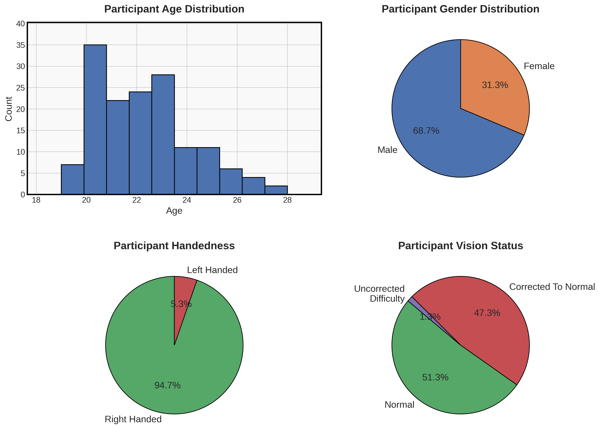

---

## 5. Experimental Hypotheses

Based on Event Segmentation Theory (EST), we predict that:

### Hypothesis 1: Overall Recognition Accuracy and Response Times
*   **Research Question:** Do people remember less and take longer to answer when a video is abruptly cut?
*   **Independent Variable (IV):** Video condition (Natural Cut vs. Abrupt Cut)
*   **Dependent Variables (DV):** Recognition accuracy (`resp.corr`) and Recognition response time (`resp.rt`)
*   **Statistical Test:** Independent samples t-test

**Accuracy Statements (Directional):**
*   **H0 (Null):** There is no difference in overall recognition accuracy between the Natural Cut and Abrupt Cut groups.
*   **H1 (Alternate):** Participants in the Natural Cut group have higher overall recognition accuracy than participants in the Abrupt Cut group.

**Response Time Statements (Directional):**
*   **H0 (Null):** There is no difference in overall recognition response times between the Natural Cut and Abrupt Cut groups.
*   **H1 (Alternate):** Participants in the Natural Cut group have faster recognition response times than participants in the Abrupt Cut group.

---

### Hypothesis 2: Accuracy Across Frame Types
*   **Research Question:** Does an abrupt cut mostly mess up a person's memory for the exact moments right before the video cut out?

**Part A: Before Boundary Frames**
*   **Independent Variable (IV):** Video condition (Natural Cut vs. Abrupt Cut)
*   **Dependent Variable (DV):** Recognition accuracy (`resp.corr`)
*   **Statistical Test:** Independent samples t-test

**Statements:**
*   **H0 (Null):** There is no difference in recognition accuracy for before boundary frames between the Natural Cut and Abrupt Cut groups.
*   **H1 (Alternate):** Recognition accuracy for before boundary frames is higher in the Natural Cut group than the Abrupt Cut group.

**Part B: Event-Middle Frames**
*   **Independent Variable (IV):** Video condition (Natural Cut vs. Abrupt Cut)
*   **Dependent Variable (DV):** Recognition accuracy (`resp.corr`)
*   **Statistical Test:** Independent samples t-test

**Statements:**
*   **H0 (Null):** There is no difference in recognition accuracy for event-middle frames between the Natural Cut and Abrupt Cut groups.
*   **H1 (Alternate):** Recognition accuracy for event-middle frames does not differ significantly between the groups.

---

### Hypothesis 3: Confidence and Correctness
*   **Research Question:** Does watching an abruptly cut video make people doubt themselves more when they actually get the answer right?

**Part A: Correct Responses**
*   **Independent Variable (IV):** Video condition (Natural Cut vs. Abrupt Cut)
*   **Dependent Variable (DV):** Confidence Rating (`conf_radio.response`)
*   **Statistical Test:** Independent samples t-test

**Statements:**
*   **H0 (Null):** There is no difference in confidence ratings for correct responses between the Natural Cut and Abrupt Cut groups.
*   **H1 (Alternate):** Participants in the Natural Cut group will report higher confidence ratings for their correct responses compared to the Abrupt Cut group.

**Part B: Incorrect Responses**
*   **Independent Variable (IV):** Video condition (Natural Cut vs. Abrupt Cut)
*   **Dependent Variable (DV):** Confidence Rating (`conf_radio.response`)
*   **Statistical Test:** Independent samples t-test

**Statements:**
*   **H0 (Null):** There is no difference in confidence ratings for incorrect responses between the Natural Cut and Abrupt Cut groups.
*   **H1 (Alternate):** Confidence ratings for incorrect responses will not differ significantly between the two conditions.

---

### Hypothesis 4: Confidence Calibration Across Frame Types
*   **Research Question:** Do people only lose confidence in their memories for the exact moments that were disrupted by the cut?

**Part A: Before Boundary Frames**
*   **Independent Variable (IV):** Video condition (Natural Cut vs. Abrupt Cut)
*   **Dependent Variable (DV):** Confidence Rating (`conf_radio.response`)      
*   **Statistical Test:** Independent samples t-test

**Statements:**
*   **H0 (Null):** There is no difference in confidence ratings for before boundary frames between the Natural Cut and Abrupt Cut groups.
*   **H1 (Alternate):** Participants in the Abrupt Cut group will report lower confidence ratings specifically for before boundary frames compared to the Natural Cut group.

**Part B: Event-Middle Frames**
*   **Independent Variable (IV):** Video condition (Natural Cut vs. Abrupt Cut)
*   **Dependent Variable (DV):** Confidence Rating (`conf_radio.response`)      
*   **Statistical Test:** Independent samples t-test

**Statements:**
*   **H0 (Null):** There is no difference in confidence ratings for event-middle frames between the Natural Cut and Abrupt Cut groups.
*   **H1 (Alternate):** Confidence ratings for event-middle frames will not differ significantly between the groups.

---

### Hypothesis 5: Demographic Factors
*   **Research Question:** Do things like a person's age or gender affect how well they remember the videos?
*   **Independent Variable (IV):** Demographic factor
*   **Dependent Variable (DV):** Overall recognition accuracy (`resp.corr`)
*   **Statistical Test:** Independent samples t-test

**Statements (Non-Directional):**
*   **H0 (Null):** Demographic factors have no significant effect on overall recognition accuracy.
*   **H1 (Alternate):** Demographic factors have a significant effect on overall recognition accuracy.

---

## 6. Statistical Analysis
### Terminology

| Term           | Meaning                                                                                                                                 |
| :------------- | :-------------------------------------------------------------------------------------------------------------------------------------- |
| **n**          | Number of participants in that group                                                                                                    |
| **M**          | Mean (average) of the measured variable for the group                                                                                   |
| **t**          | t-statistic                                                                                                                             |
| **r**          | Pearson correlation coefficient                                                                                                         |
| **p**          | Probability of observing a result this extreme if there were truly no difference (p-value)                                              |
| **One-tailed** | Used when the hypothesis predicts a specific direction (e.g., NB accuracy will be *higher* than AB). More powerful for that direction   |
| **Two-tailed** | Used when no direction is predicted — just asking whether there is *any* difference                                                     |
| **IQR**        | Interquartile Range: the distance between the 25th (Q25) and 75th (Q75) percentiles — measures the spread of the middle 50% of the data |

---
### Hypothesis 1: Overall Accuracy and Response Time
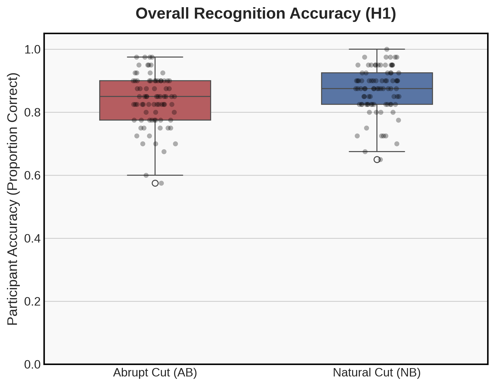

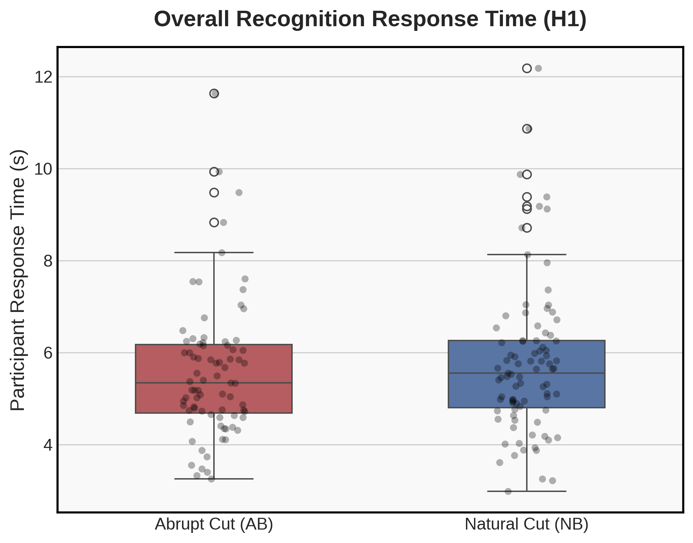

#### Descriptive Statistics (H1)
| Variable          | Group            |   n   |   M   |  SD   |    IQR (Q25–Q75)    |
| :---------------- | :--------------- | :---: | :---: | :---: | :-----------------: |
| Accuracy          | Natural Cut (NB) |  87   | 0.870 | 0.073 | 0.100 (0.825–0.925) |
| Accuracy          | Abrupt Cut (AB)  |  79   | 0.838 | 0.082 | 0.125 (0.775–0.900) |
| Response Time (s) | Natural Cut (NB) |  87   | 5.765 | 1.637 | 1.461 (4.800–6.261) |
| Response Time (s) | Abrupt Cut (AB)  |  79   | 5.581 | 1.484 | 1.486 (4.688–6.174) |

#### Inferential Statistics (H1)
| Test                   | Tail       |   t   |   p   | Significance |
| :--------------------- | :--------- | :---: | :---: | :----------: |
| Accuracy: NB > AB      | one-tailed | 2.707 | 0.004 |      **      |
| Response Time: NB < AB | one-tailed | 0.761 | 0.776 |      ns      |

#### Final Analysis (H1)
*   **Accuracy:** The Natural Cut (NB) group achieved significantly higher accuracy than the Abrupt Cut (AB) group ($p = 0.004$). We **reject the null hypothesis ($H_0$)** and support the alternate hypothesis ($H_1$).
*   **Response Time:** There was no significant difference in response times between the groups ($p = 0.776$). We **fail to reject the null hypothesis ($H_0$)**.

### Hypothesis 2: Accuracy Across Frame Types
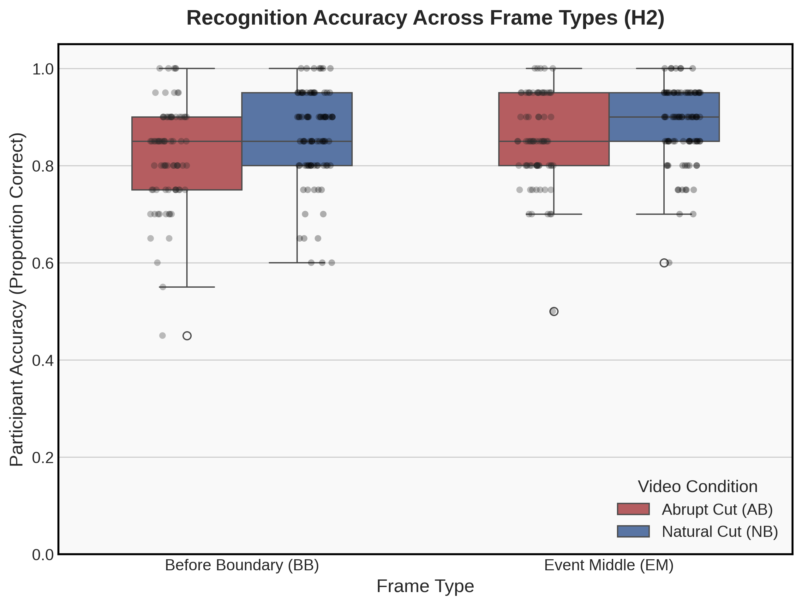

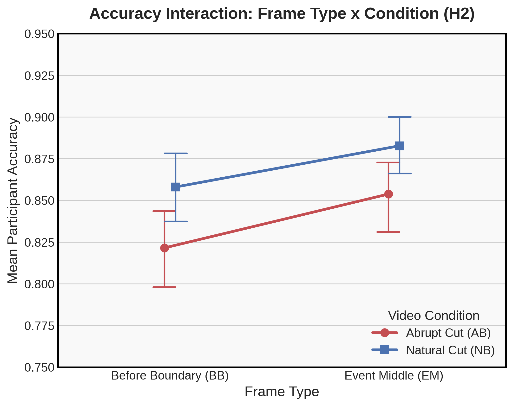

---

#### Descriptive Statistics (H2)
| Variable | Condition        | Frame Type      |   n   |   M   |  SD   |    IQR (Q25–Q75)    |
| :------- | :--------------- | :-------------- | :---: | :---: | :---: | :-----------------: |
| Accuracy | Natural Cut (NB) | Before Boundary |  87   | 0.858 | 0.097 | 0.150 (0.800–0.950) |
| Accuracy | Abrupt Cut (AB)  | Before Boundary |  79   | 0.822 | 0.105 | 0.150 (0.750–0.900) |
| Accuracy | Natural Cut (NB) | Event Middle    |  87   | 0.883 | 0.080 | 0.100 (0.850–0.950) |
| Accuracy | Abrupt Cut (AB)  | Event Middle    |  79   | 0.854 | 0.093 | 0.150 (0.800–0.950) |

#### Inferential Statistics (H2)
| Test                                | Tail       |   t   |   p   | Significance |
| :---------------------------------- | :--------- | :---: | :---: | :----------: |
| Accuracy — Before Boundary: NB > AB | one-tailed | 2.329 | 0.011 |      *       |
| Accuracy — Event Middle: NB vs AB   | two-tailed | 2.151 | 0.033 |      *       |

#### Final Analysis (H2)
*   **Before Boundary:** Accuracy was significantly higher for the Natural Cut group ($p = 0.011$). We **reject the null hypothesis ($H_0$)** and support the alternate hypothesis ($H_1$).
*   **Event Middle:** Interestingly, a significant difference was also found here ($p = 0.033$), suggesting a general memory advantage for Natural Cuts even in non-disrupted segments. We **reject the null hypothesis ($H_0$)**.

---

### Hypothesis 3: Confidence and Correctness
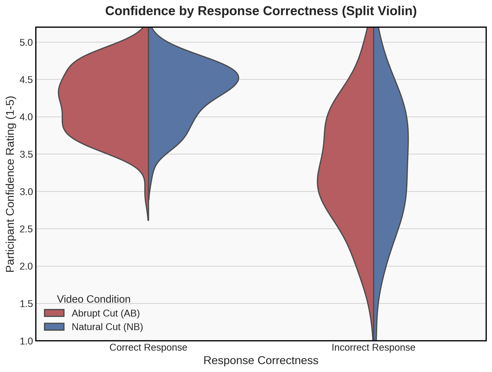

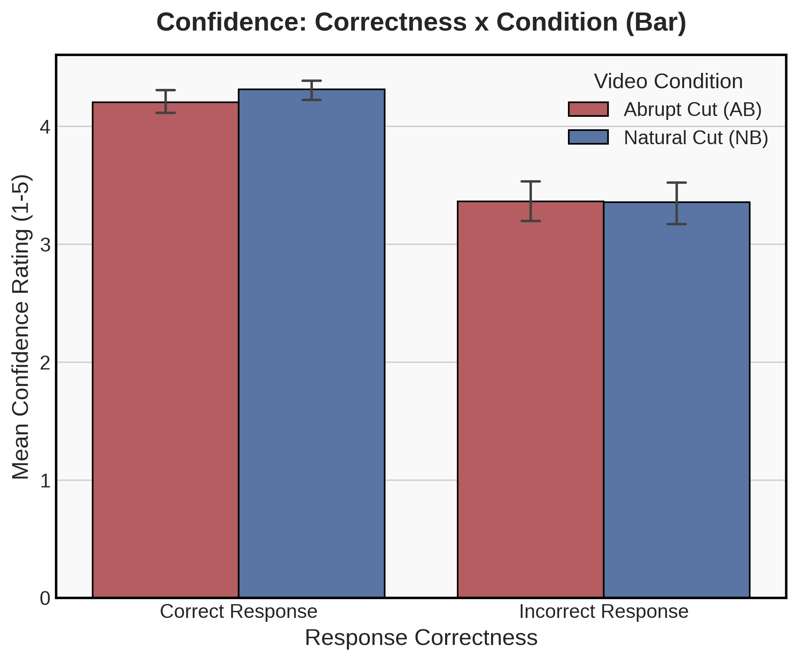

#### Descriptive Statistics (H3)
| Variable   | Condition        | Correctness |   n   |   M   |  SD   |    IQR (Q25–Q75)    |
| :--------- | :--------------- | :---------- | :---: | :---: | :---: | :-----------------: |
| Confidence | Natural Cut (NB) | Correct     |  87   | 4.314 | 0.389 | 0.551 (4.055–4.606) |
| Confidence | Abrupt Cut (AB)  | Correct     |  79   | 4.204 | 0.430 | 0.711 (3.866–4.577) |
| Confidence | Natural Cut (NB) | Incorrect   |  86   | 3.356 | 0.874 | 1.200 (2.800–4.000) |
| Confidence | Abrupt Cut (AB)  | Incorrect   |  79   | 3.362 | 0.787 | 1.194 (2.806–4.000) |

#### Inferential Statistics (H3)
| Test                                       | Tail       |   t    |   p   | Significance |
| :----------------------------------------- | :--------- | :----: | :---: | :----------: |
| Confidence — Correct Responses: NB > AB    | one-tailed | 1.717  | 0.044 |      *       |
| Confidence — Incorrect Responses: NB vs AB | two-tailed | -0.041 | 0.968 |      ns      |

#### Final Analysis (H3)
*   **Correct Responses:** The Natural Cut group reported significantly higher confidence when they were correct ($p = 0.044$). We **reject the null hypothesis ($H_0$)** and support the alternate hypothesis ($H_1$).
*   **Incorrect Responses:** There was no significant difference in confidence when participants were wrong ($p = 0.968$). We **fail to reject the null hypothesis ($H_0$)**.

---

### Hypothesis 4: Confidence Calibration Across Frame Types
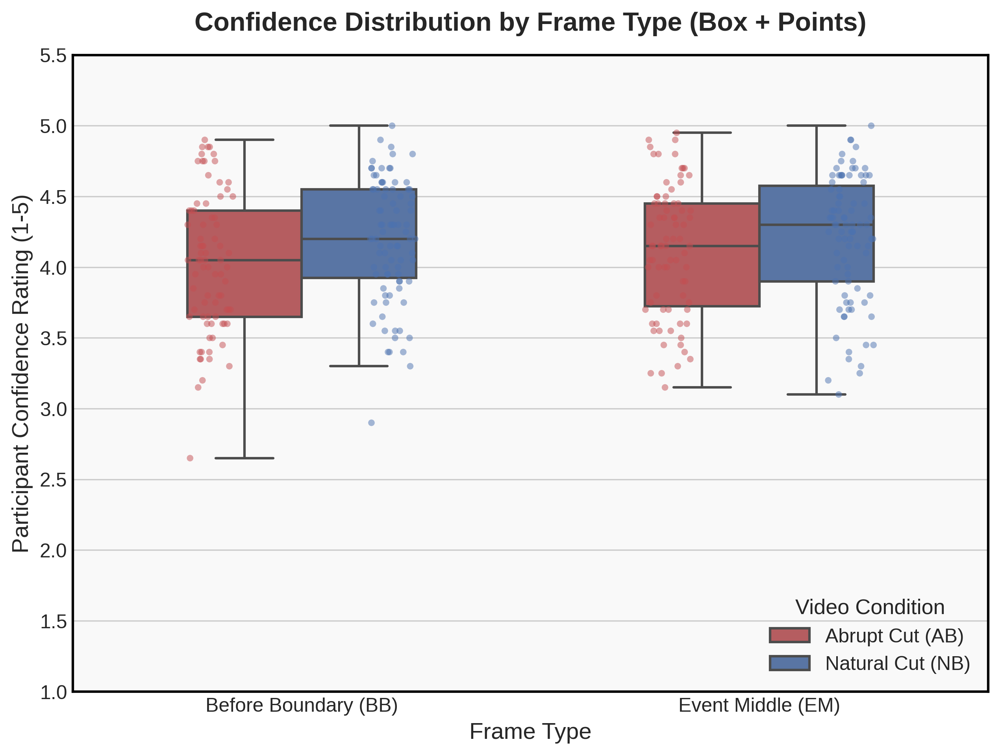

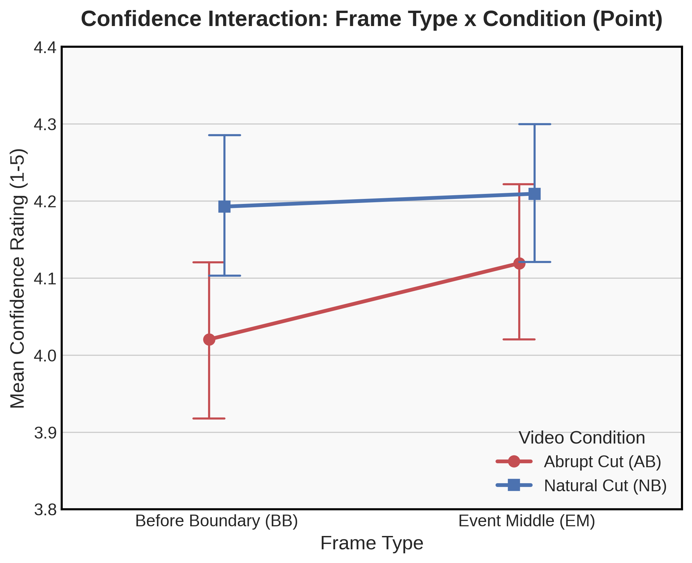

#### Descriptive Statistics (H4)
| Variable   | Condition        | Frame Type      |   n   |   M   |  SD   |    IQR (Q25–Q75)    |
| :--------- | :--------------- | :-------------- | :---: | :---: | :---: | :-----------------: |
| Confidence | Natural Cut (NB) | Before Boundary |  87   | 4.193 | 0.428 | 0.625 (3.925–4.550) |
| Confidence | Abrupt Cut (AB)  | Before Boundary |  79   | 4.020 | 0.491 | 0.750 (3.650–4.400) |
| Confidence | Natural Cut (NB) | Event Middle    |  87   | 4.209 | 0.446 | 0.675 (3.900–4.575) |
| Confidence | Abrupt Cut (AB)  | Event Middle    |  79   | 4.119 | 0.461 | 0.725 (3.725–4.450) |

#### Inferential Statistics (H4)
| Test                                  | Tail       |   t   |   p   | Significance |
| :------------------------------------ | :--------- | :---: | :---: | :----------: |
| Confidence — Before Boundary: NB > AB | one-tailed | 2.399 | 0.009 |      **      |
| Confidence — Event Middle: NB vs AB   | two-tailed | 1.279 | 0.203 |      ns      |

#### Final Analysis (H4)
*   **Before Boundary:** Confidence was significantly lower in the Abrupt Cut group for frames immediately preceding the cut ($p = 0.009$). We **reject the null hypothesis ($H_0$)** and support the alternate hypothesis ($H_1$).
*   **Event Middle:** No significant difference in confidence was found for mid-event frames ($p = 0.203$). We **fail to reject the null hypothesis ($H_0$)**.

---

### Hypothesis 5: Demographic Factors
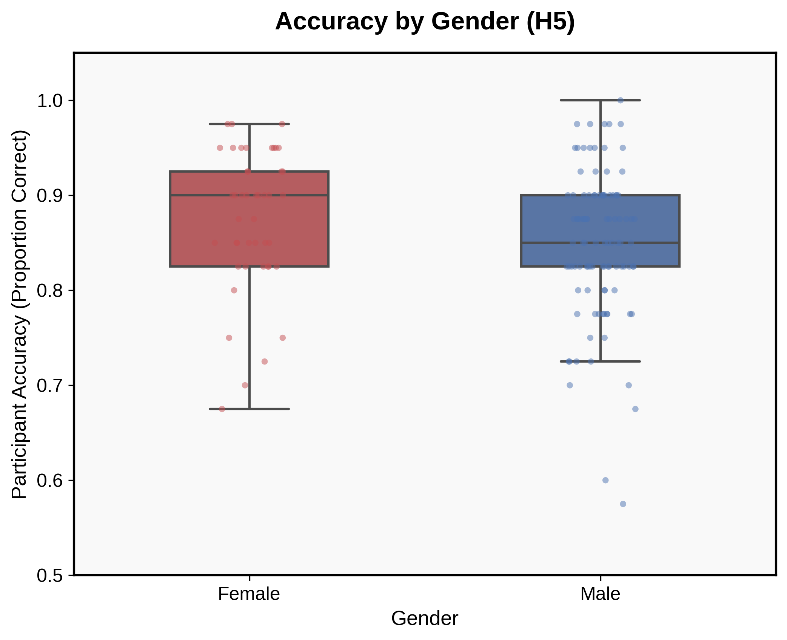

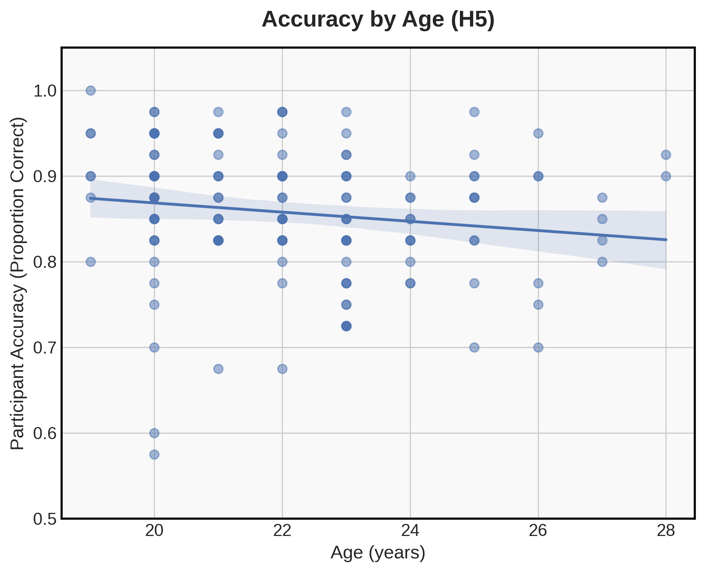

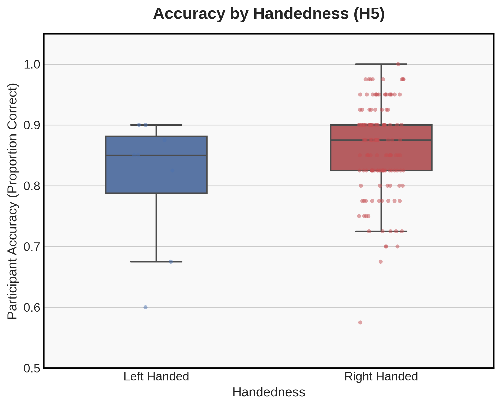

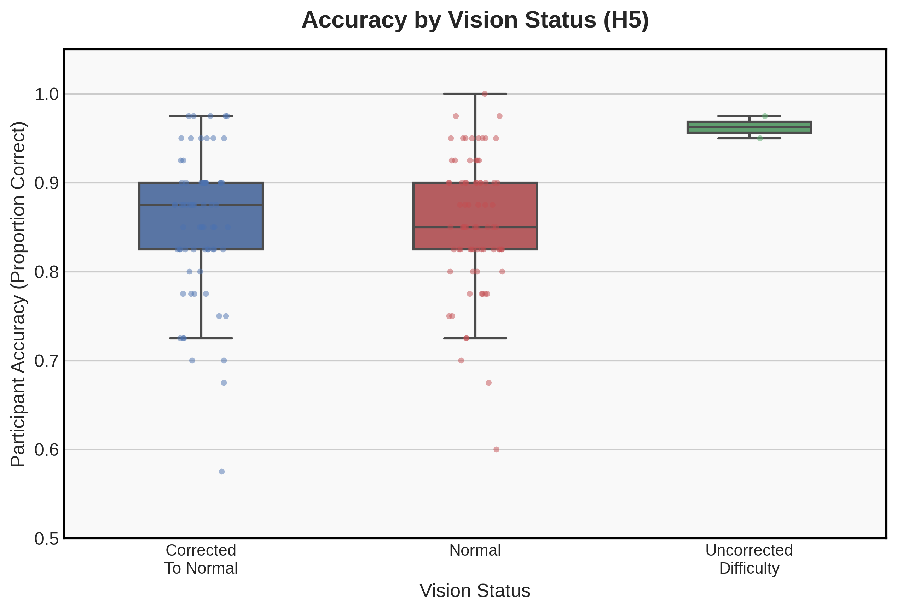

#### Descriptive Statistics (H5)
| Variable | Group            |   n   |   M   |  SD   |    IQR (Q25–Q75)    |
| :------- | :--------------- | :---: | :---: | :---: | :-----------------: |
| Accuracy | Male             |  103  | 0.849 | 0.074 | 0.100 (0.800–0.900) |
| Accuracy | Female           |  45   | 0.875 | 0.073 | 0.100 (0.825–0.925) |
| Accuracy | Right-Handed     |  140  | 0.860 | 0.076 | 0.100 (0.810–0.910) |
| Accuracy | Left-Handed      |   8   | 0.809 | 0.092 | 0.119 (0.731–0.850) |
| Accuracy | Normal Vision    |  75   | 0.856 | 0.076 | 0.100 (0.810–0.910) |
| Accuracy | Corrected Vision |  71   | 0.855 | 0.077 | 0.100 (0.800–0.900) |

#### Inferential Statistics (H5)
| Test                                 | Statistic                  |   t / r    |   p   | Significance |
| :----------------------------------- | :------------------------- | :--------: | :---: | :----------: |
| Accuracy: Male vs Female             | Indep. t-test (two-tailed) | t = -1.956 | 0.054 |      ns      |
| Accuracy: Right vs Left Handed       | Indep. t-test (two-tailed) | t = 1.261  | 0.246 |      ns      |
| Accuracy ~ Age                       | Pearson Correlation        | r = -0.147 | 0.075 |      ns      |
| Accuracy: Normal vs Corrected Vision | Indep. t-test (two-tailed) | t = 0.111  | 0.911 |      ns      |

#### Final Analysis (H5)
*   No demographic factors (Gender, Handedness, Age, or Vision) showed a significant effect on recognition accuracy (all $p > 0.05$). We **fail to reject the null hypothesis ($H_0$)** for demographic impacts on this experimental task.

---

Significance codes: *** = p < 0.001,  ** = p < 0.01,  * = p < 0.05,  ns = not significant

---

## 7. Conclusions

Based on the statistical analysis of the experimental data, the following statements describe the observations:

### Hypothesis 1
- **Overall Accuracy:** Participants in the Natural Cut group have higher overall recognition accuracy than participants in the Abrupt Cut group.
- **Response Time:** There is no difference in overall recognition response times between the Natural Cut and Abrupt Cut groups.

### Hypothesis 2
- **Before Boundary Frames:** Recognition accuracy for frames immediately preceding an event boundary is higher in the Natural Cut group than the Abrupt Cut group.
- **Event-Middle Frames:** Recognition accuracy for frames in the middle of an event is higher for the Natural Cut group than the Abrupt Cut group.

### Hypothesis 3
- **Correct Responses:** Participants in the Natural Cut group report higher confidence ratings for their correct responses compared to those in the Abrupt Cut group.
- **Incorrect Responses:** Confidence ratings for incorrect responses do not differ significantly between the two viewing conditions.

### Hypothesis 4
- **Before Boundary Frames:** Participants in the Abrupt Cut group report lower confidence ratings specifically for frames immediately preceding the cut compared to the Natural Cut group.
- **Event-Middle Frames:** Confidence ratings for mid-event frames do not differ significantly between the groups.

### Hypothesis 5
- **Demographic Factors:** Demographic factors (gender, age, handedness, and vision) have no significant effect on overall recognition accuracy.

---

## 8. Future Steps

While our results clearly show that abrupt cuts make it harder for people to remember what they saw, this is just the beginning of the story. If we were to take this research further, here are some interesting directions we could explore:

### 8.1 New Questions to Dive Into
*   **Is it "Bad Memory" or just "Guessing"?** Right now, we know people in the Abrupt Cut group score lower, but we don't know *why*. Using a technique called **Signal Detection Theory**, we could figure out if they actually have a weaker memory of the images, or if they're just becoming more likely to "guess" incorrectly because they're frustrated by the choppy video.
*   **Does Video Length Matter?** Does a longer video provide enough context to "protect" your memory from a sudden cut? Or does a cut in a 2-minute scene feel even more jarred than in a 10-second clip? We'd love to see if the duration of the story changes how much these boundaries matter.

### 8.2 Expanded Analysis
To get an even clearer picture, we could use some more advanced statistical tools:
*   **ANOVA Testing:** This would let us look at how different factors (like cut type and frame category) interact with each other in one big test, rather than doing them separately.

---

## 9. References & Citations

1. **Zacks, J. M., Speer, N. K., Swallow, K. M., Braver, T. S., & Reynolds, J. R. (2007). *Event perception: a mind-brain perspective.***
   Introduced the core idea of Event Segmentation Theory (EST): the brain naturally divides continuous experiences into distinct events based on prediction errors.

2. **Radvansky, G. A., & Copeland, D. E. (2006). *Walking through doorways causes forgetting: Situation models and experienced space.***
   Demonstrated the "Doorway Effect," proving that crossing a spatial boundary forces the brain to refresh its event model, impairing memory of the previous context.

3. **Swallow, K. M., Zacks, J. M., & Abrams, R. A. (2009). *Event Boundaries in Perception Affect Memory Encoding and Updating.***
   Identified the "Boundary Advantage," showing that objects appearing exactly at event boundaries are encoded more strongly than those in the middle of events.

4. **Cutting, J. E., Brunick, K. L., & Candan, A. (2012). *Perceiving event dynamics and parsing Hollywood films.***
   Demonstrated that viewers perceive "events" in films based largely on bottom-up perceptual cues (camera cuts, lighting) rather than narrative arcs.

5. **Boltz, M. G. (1992). *Temporal framing of film and the predictability of event boundaries.***
   Showed that interrupting a film with breaks *at* natural event boundaries improves recall, while breaks placed at non-boundaries severely impair memory encoding by disrupting the active event model.

6. **Radvansky, G. A., & Zacks, J. M. (2017). *Event Boundaries in Memory and Cognition.***
   Expanded EST into the "Event Horizon Model," detailing how event boundaries serve as structural anchors for long-term memory organization.
